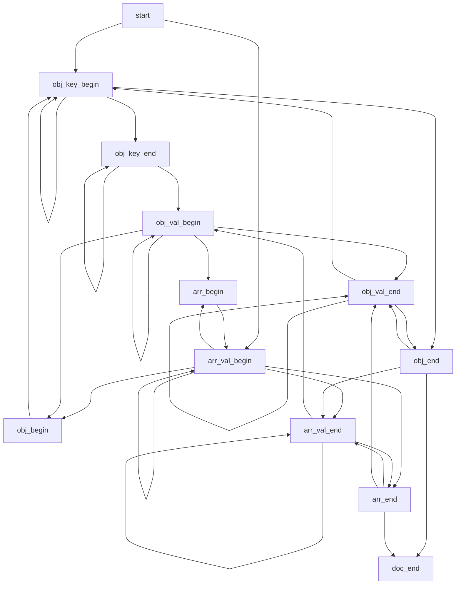

yyjson `read_root_pretty`

```mermaid 
graph TD
aa[start]--->a[obj_key_begin]
aa--->b[arr_val_begin]
a--->a
a--->c[obj_key_end]
a--->d[obj_end]
b--->e[obj_begin]
b--->f[arr_begin]
b--->g[arr_val_end]
b--->h[arr_end]
b--->b
c--->i[obj_val_begin]
c--->c
d--->k[doc_end]
d--->j[obj_val_end]
d--->g
e--->a
f--->b
g--->i
g--->h
g--->g
h--->k
h--->g
h--->j
i--->j
i--->e
i--->f
i--->i
j--->a
j--->d
j--->j
```
