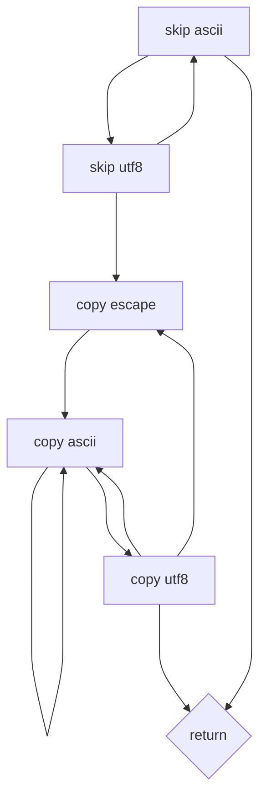
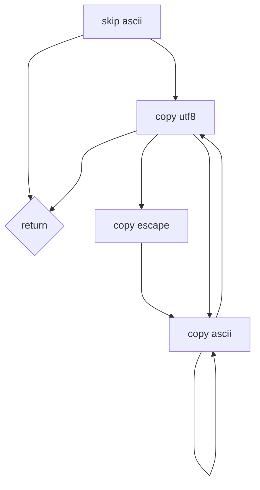

yyjson `read_string`

```mermaid 
graph TD
a[skip ascii]--->b[skip utf8]
b--->a
b--->c[copy escape]
c--->d[copy ascii]
d--->d
d--->e[copy utf8]
e--->d
e--->c
e--->f{return}
a--->f
```

pyyjson `read_string`

```mermaid
graph TD
a[skip ascii]--->e[copy utf8]
a--->f{return}
e--->c[copy escape]
c--->d[copy ascii]
d--->d
e--->d
d--->e
e--->f

```

